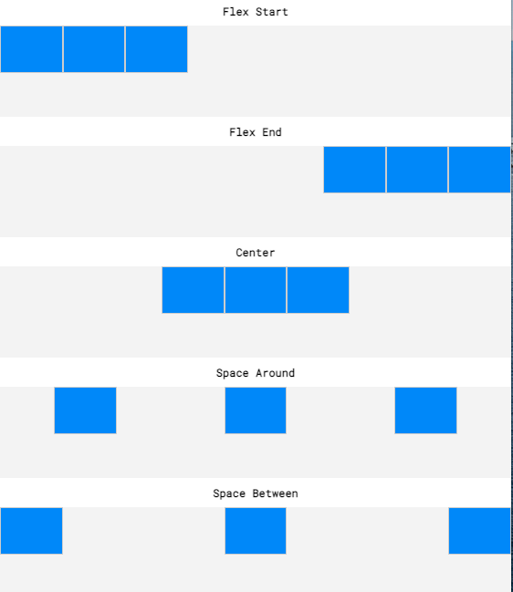
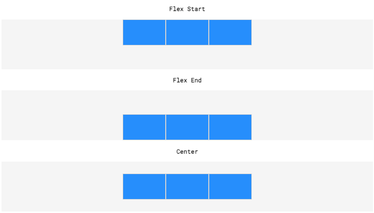

# 💪 CSS flex

**Flex** allows us to position elements more easily and we should look at elements using this model as either a:

* **flex container**
* **flex item**

### Flex containers

To make an element a flex container (also known as a **wrapper**), we would add `display: flex` in its CSS...

```css
.flex-wpr {
    display: flex
}
```

...then apply it in its corresponding HTML tag:

```markup
<div class="flex-wpr">
<!-- this is now a flex container -->
</div>
```

#### inline-flex

Using `display: inline-flex` creates a container that won't take up the full width so elements can exist _beside the container_:

```css
.flex-inline-wpr { 
    display: inline-flex
}
.non-flex-inline-wpr {
    display: inline
}
```

```markup
<div class="flex-inline-wpr">
    <!-- this is now a flex container -->
</div>
<div class="non-flex-inline-wpr">
    <!-- this can appear beside flex-wpr instead of under -->
</div>
```

Items _within the container_ would still enjoy the flexbox layout!

### Flex container properties

#### Aligning flex items with flex container properties

* `justify-content` (**horizontal alignment**)
  1. `flex-start`
  2. `flex-end`
  3. `center`
  4. `space-around`
  5. `space-between`




```markup
...
<div class="flex-wpr">
    <div class="flex-item">a</div>
    <div class="flex-item">b</div>
    <div class="flex-item">c</div>
</div>
...
```



```css
.flex-item {
    justify-content: flex-end;
}
```


* `align-items` (**vertical alignment for a single row**)
  * `flex-start`
  * `flex-end`
  * `center`



* `align-content` (**vertical alignment** for the _**entire flex container**_)
  * `flex-start` (see `align-items` for diagram)
  * `flex-end` (see `align-items` for diagram)
  * `center` (see `align-items` for diagram)
  * `space-around` (see `justify-content` for diagram but vertically)
  * `space-between` (see `justify-content` for diagram but vertically)

#### Re-sizing flex items with flex container properties

* `flex-grow` (let the **items grow** for large window sizes)
  * positive numeric value `x` sets it to `x` times of its default grow size
* `flex-shrink` (let the **items shrink** for small window sizes)
  * positive numeric value `x` sets it to `1/x` times of its the default grow size
  * a value of `0` shrinks the item to the smallest possible
* `flex-basis` (let the items **grow/shrink with a limit**)
  * positive numeric value + `px`
* `flex` (shorthand **combining grow + shrink + basis**)
  * `flex: 2 1 150px` means
    * `flex-grow` of 2
    * `flex-shrink` of 1
    * `flex-basis` of 150px

#### Arranging flex items with flex container properties

* `flex-direction` (**arrangement** of items)
  * `row` (items arranged from left to right, from the top left)
  * `row-reverse` (items arranged from right to left, from the top right)
  * `column` (items arranged from top to bottom, from the top left)
  * `column-reverse` (items arranged from bottom to top, from the bottom right)
* `flex-wrap` (let the **items wrap to new lines**)
  * `wrap` (wrap items into new line if there's no space)
  * `wrap-reverse` (same as `wrap` but reverse the item order)
  * `nowrap` (don't wrap)
* `flex-flow` (shorthand **combining flex-direction and flex-wrap**)
  * `flex-flow: column wrap`
    * `flex-direction` of column
    * `flex-wrap` of wrap

### Flex items

To make a _block element_ a flex item, simply include them into the already-defined flex container:

```markup
<div class="flex-wpr">
    <div>a</div>
    <div>b</div>
    <div>c</div>
</div>
```

We will notice that the flex items will appear inline by default, rather than the full-width of the default `<div>`

From there, we can _align_, _re-size_ and _arrange_ these flex items with ease!

### Review

* **setup**
  * `display: flex` (make child divs inline)
  * `display: flex-inline` (make itself inline among other divs)
* **alignment**
  * `justify-content` (horizontal centering)
    * `flex-start`, `flex-end`, `center`, `space-around`, `space-between`
  * `align-items` (vertical centering of container's items)
    * `flex-start`, `flex-end`, `center`
  * `align-content` (vertical centering of entire container)
    * `flex-start`, `flex-end`, `center`, `space-around`, `space-between`
* **resizing**
  * `flex-grow`
  * `flex-shrink`
  * `flex-basis`
  * `flex` (shorthand for the above three properties)
* **arrangement**
  * `flex-direction`
    * `row`, `row-reverse`, `column`, `column-reverse`
  * `flex-wrap`
    * `wrap`, `wrap-reverse`, `nowrap`
  * `flex-flow` (shorthand for the above two properties)
