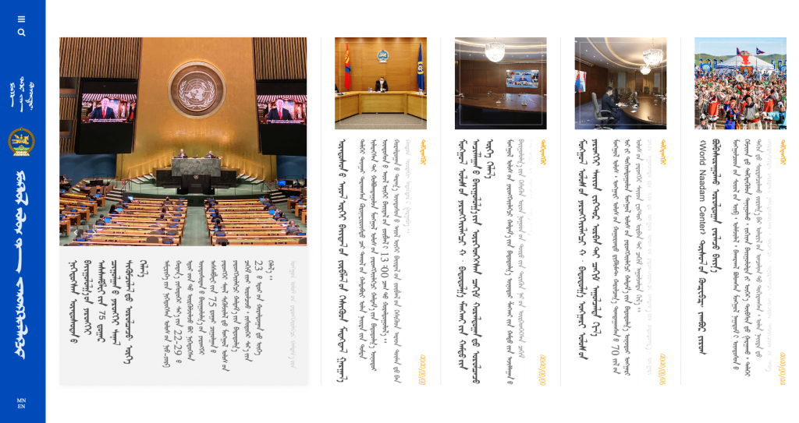

# ➡️ Web development

**Web development** comes in two main flavours:

* The **front-end** (presentation-oriented programming, i.e. _the display_)
* The **back-end** (data and logic-oriented programming, i.e. _the data_)

We will see on this page that:

* the line between the front-end and the back-end often blurs
* computer science theory plays a large role in web development in surprising ways

### The front-end

To present data, we connect the following "3 S's":

* **Structuring** (e.g. HTML)
  * to enforce the **sensibility (order) of visual components**
  * to ensure that everyone has **access** to a web resource
* **Styling** (e.g. CSS)
  * to enhance the **visual look-and-feel**
* **Scripting** (e.g. JavaScript, PHP, Ruby, etc.)
  * to manage **user input** and **data changes**
  * to connect the front-end with the back-end
  * to build upon other scripting languages (e.g. React, Next.js)


[html](html/)



[css](css/)



[javascript](javascript/)



[react](react/)



[next.js](next.js/)


Sometimes, front-end developers may have to take part in:

* **Imaging** (e.g. Photoshop or free [Photopea](https://www.photopea.com))
  * to adjust (resize, crop, etc.) visual assets provided by a client
  * to take the load off the design team who might work with more complex imaging and graphics projects

### The back-end

The back-end usually involves:

* **Scripting** (e.g. also JavaScript, with some PHP, Ruby, Perl and older programming languages)
  * to **process the results** from database querying
* **Database querying** (e.g. GraphQL, MongoDB, MySQL)
  * to **get/set data** from a database
* **Security**
  * **Authorization** - allowing a user into a system
  * **Authentication** - checking if the user is genuine

### All developers

Each developer may also have to take part in:

* **Versioning** or **version control** (e.g. Git or Mercurial)
  * to not only submit content "to the cloud" but also to ensure backups if something goes wrong
  * to allow for collaboration by multiple developers within the same project(s)


[git](git/)


* **Deployment** (e.g. FTP, Jenkins, Netlify, etc.)
  * to get that web project onto the Internet!
    * usually nowadays handled by a specialized team called **development operations** (or **dev ops**)


[web-operations.md](web-operations.md)


* **Documenting** (e.g. GitBook!)
  * to communicate cases and learnings for obvious reasons
* **Organizing** (e.g. SCRUM)
  * to ensure that all the programming, layout, look-and-feel, content, images (and any other assets) all come together, so that the development experience goes as smoothly as possible
  * to send completed projects for quality assurance and correct defects
  * to determine a release's suitability to go "into production" (i.e. on the internet)
* **Optimizing**
  * for more universal accessibility, better usability, improved speed
  * for enhancing the experience of the "finished" product
    * note: no product ever really gets "finished"


[accessibility.md](accessibility.md)


As one can gather, a lot of web development involves tasks other than simply programming!

To begin with web development, let's have a look at our [**workspace**](workspace/)!&#x20;
