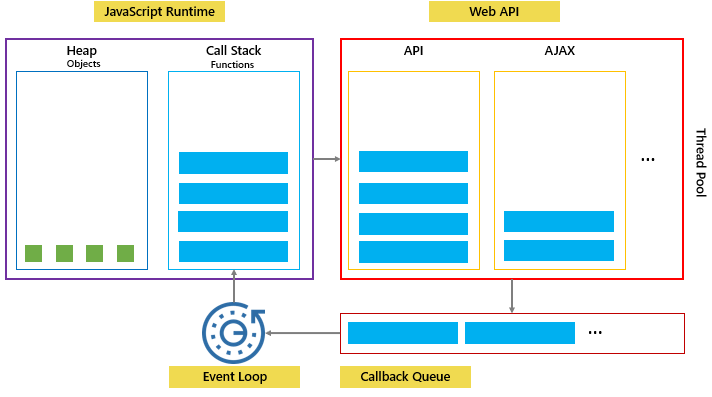

# 🟨 JavaScript (to the internet!)

So what we want now is to take our "logical" JavaScript stuff and make it do things to webpages, but first some terminologY:&#x20;

### DOM (document object model)

* **Document** = the webpage (for example)
  * A document has object(s)
* **Object** = the "stuff" (content but also other things) on the webpage
  * An object may also have its own object(s)
* **Model** = the representation of the document and the objects
  * We can represent the documents and objects in a "tree" diagram
    * Objects can have "parents" and "children", e.g.
      * the parent of `<head>` is `<html>`
      * the children of `<head>` are `<title>` and `<meta>`


Do not confuse the DOM with HTML but think of HTML as just _a_ visual _representation_ of the DOM!

A browser could have simply taken the DOM and displayed it like the diagram above ;)


Every HTML webpage on the internet has a structure based on the DOM and, thus, we can use JavaScript to access and manipulate each the structure of each webpage!


[javascript-dom-access.md](javascript-dom-access.md)



[javascript-dom-manipulation.md](javascript-dom-manipulation.md)



[javascript-dom-traversal.md](javascript-dom-traversal.md)



[javascript-interactivity-with-the-dom.md](../javascript-essential-topics/javascript-interactivity-with-the-dom.md)

