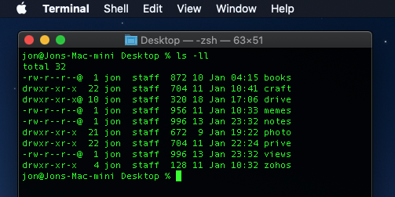

# 🖥️ Command line

We can access a computer's file system using the **command line:**&#x20;

* on Mac, via an application called _**Terminal**_&#x20;
* on Windows, via _**Command Prompt**_



### The prompt

The **prompt,** which appears when we load the command line app, shows us the current status:

On Mac, it may look something like:

```bash
jon@Jons-Mac-mini Desktop %
```

Breaking that down, part by part:&#x20;

* `jon@Jons-Mac-mini` (or similar) refers to the _**current machine**_
* `Desktop` refers to the _**current folder**_
* `%` is the _**prompt**_ (this symbol may also be `$` or `#` depending on the system)
  * just a way of stating our "cue" to type a command

On Windows, it may look something like:&#x20;

```bash
C:\projects\>
```

* `C:\` refers to the hard drive
* `projects` refers to a folder on that drive

As shorthand, we will refer to the prompt as simply `$`

### The command

A **command** consists of a:

* **keyword**
* **arguments** (the values that follow the keyword)

For example:

```bash
$ cd myfolder
```

From that:

* the keyword `cd` (change directory) has the argument `myfolder`
  * which takes us to the folder called `myfolder`

### The commands

These commands come in handy on an everyday basis:

| Command | Arguments         | What it does                                                                          |
| ------- | ----------------- | ------------------------------------------------------------------------------------- |
| `cat`   | `filename`        | prints the contents of a file (may not appear readable depending on the type of file) |
| `cd`    | `foldername`      | accesses a folder (if it exists)                                                      |
| `cd`    | `..` (literally)  | accesses the parent folder of the current folder                                      |
| `clear` | (none)            | clears the command-line screen of its history                                         |
| `ls`    | (none)            | lists the files and sub-folders of the current folder                                 |
| `mkdir` | `foldername`      | creates a directory/folder                                                            |
| `mv`    | `oldname newname` | renames ("moves") a file to a new name                                                |
| `pwd`   | (no arguments)    | prints the path of the current folder                                                 |
| `rmdir` | `foldername`      | removes the directory/folder (if it exists)                                           |
| `rm`    | `filename`        | removes the file (if it exists)                                                       |
| `touch` | `filename`        | creates a new blank file                                                              |
