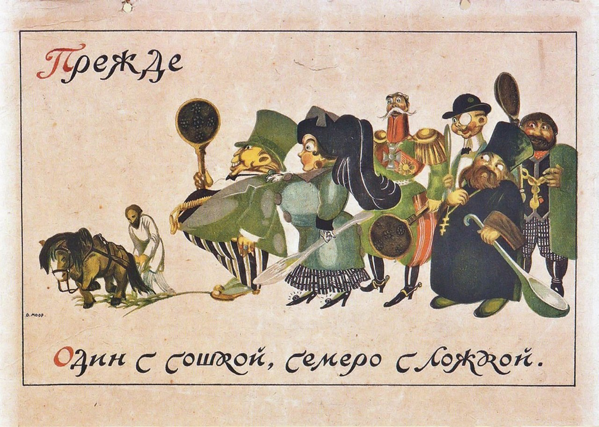

# 🪆 "One with a plow, seven with spoons"

### Original idiom

*   **один с сошкой, а семеро с ложкой**

    (odin s soshkoy, a semero s lozhkoy)

<figure><figcaption></figcaption></figure>

### Literal translation

* один = one
* с сошкой = with plow
* а семеро = but seven
* с ложкой = with spoon(s)

### Commentary

* Many people rely on one key person, often under-appreciated and overworked

### Supplementary

* [Wiktionary](https://en.wiktionary.org/wiki/%D0%BE%D0%B4%D0%B8%D0%BD_%D1%81_%D1%81%D0%BE%D1%88%D0%BA%D0%BE%D0%B9,_%D0%B0_%D1%81%D0%B5%D0%BC%D0%B5%D1%80%D0%BE_%D1%81_%D0%BB%D0%BE%D0%B6%D0%BA%D0%BE%D0%B9#Russian)

